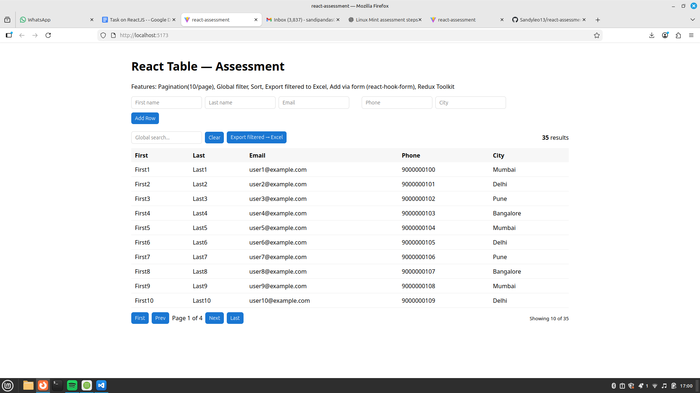
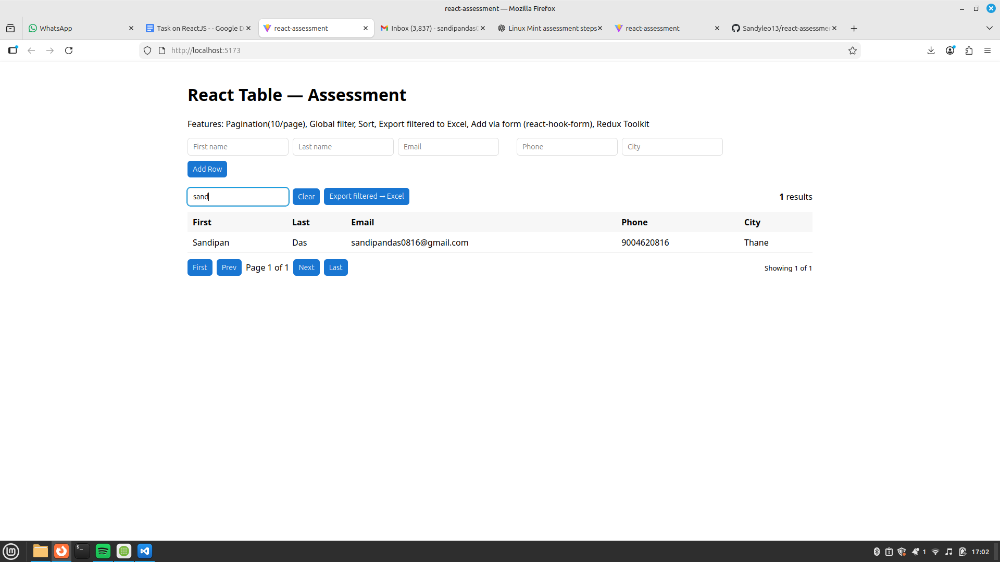
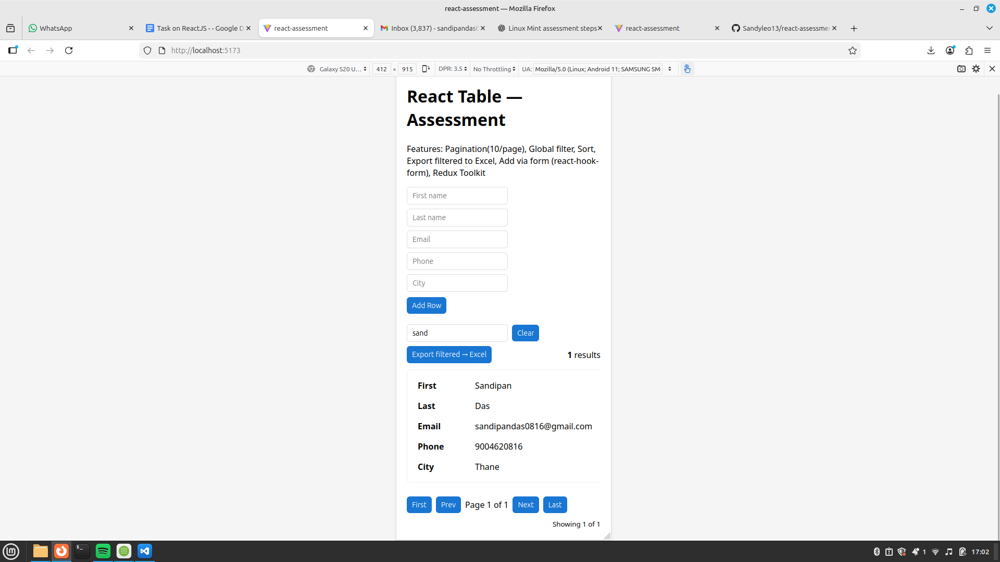

# React Assessment – Dynamic Table with Redux, Validation & Excel Export

This is a React.js assessment project implementing a feature-rich data table with:
Pagination, Sorting, Global Filter, Excel Export (filtered rows only), and a validated Form using react-hook-form.  
State management is handled using Redux Toolkit.

---

##  Screenshots

###  Desktop View


###  Filtered Search View


###  Mobile View


---

##  Demonstration Video

Click below to view the full demo video:

[ Watch Demo Video](screenshots/demo.mp4)


> Replace VIDEO_ID with your actual YouTube video ID.

---

##  Features Implemented

###  Table Functionalities
- Pagination (10 rows per page)
- Global search filter
- Column sorting (ASC/DESC)
- Mobile responsive
- Export filtered rows to Excel (.xlsx)
- Live updates when filtering

###  Form (react-hook-form)
- First name, Last name, Email, Phone, City fields
- Required validation + error messages
- On submit → new row added to Redux

###  Redux Toolkit
- Global state management
- Slice for managing rows
- Actions: addRow, setRows
- Fully typed with TypeScript

---

##  Folder Structure

```
src/
 ├─ components/
 │   ├─ AddRowForm.tsx
 │   ├─ DataTable.tsx
 │
 ├─ store/
 │   ├─ tableSlice.ts
 │   ├─ index.ts
 │
 ├─ utils/
 │   ├─ exportExcel.ts
 │
 ├─ App.tsx
 └─ main.tsx
```

---

##  Installation & Setup

###  Clone repository:
git clone https://github.com/Sandyleo13/react-assessment.git
cd react-assessment

###  Install dependencies:
npm install

###  Run locally:
npm run dev

Visit:
http://localhost:5173

---

## Production Build
npm run build

---

## Usage Guide
- Use form to add entries  
- Filter rows using global search  
- Sort columns  
- Export filtered rows to Excel  
- Pagination (10 per page)

---

##  Author
**Sandipan Das**  
GitHub: https://github.com/Sandyleo13  
Email: sandipandas0816@gmail.com

---
